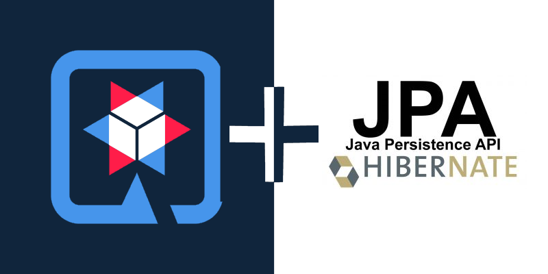

## Quarkus - JPA Beispiel (Stundenplanverwaltung)

#### Starting

- **1:** Clone the Project
  - `git clone https://github.com/1920-5bhif-nvs/01-assignment-quarkus-jpa-FabianAhammer.git`
- **2:** Start docker inside the Project Directory 
  - `cd  <projectname>`
  - `docker-compose up -d`
- **3:**  Start the Quarkus Application Server
  - `./mvnw compile quarkus:dev`
  - _Alternative:_ `./quickstart.bat`